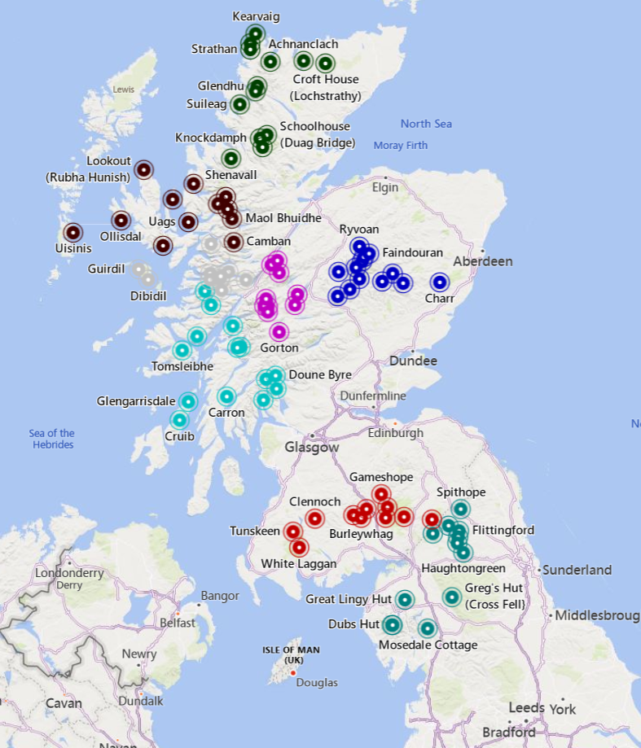

# Mountain Bothies

Scraping of Mountain Bothie locations from the Mountain Bothie website <https://www.mountainbothies.org.uk/bothies/location-map/>.

see more maps on <https://alifeee.co.uk/maps/>

Info output as `geoJSON` file -> [`bothies.geojson`](./bothies.geojson), for example,

```json
...
{
    "type": "Feature",
    "properties": {
        "url": "https://www.mountainbothies.org.uk/bothies/northern-highlands/croft-house-lochstrathy/",
        "features": [
            "Open fire",
            "Strictly no vehicle access",
            "Dogs under strict control"
        ],
        "name": "Croft House (Lochstrathy)",
        "location": "Northern Highlands"
    },
    "geometry": {
        "type": "Point",
        "coordinates": [
            -4.066687736144918,
            58.412679049987325
        ]
    }
},
...
```

Load this file on any mapping software, such as <https://geojson.io/>.

<https://geojson.io/#data=data:text/x-url,https%3A%2F%2Fraw.githubusercontent.com%2Falifeee%2Fmountain-bothies%2Frefs%2Fheads%2Fmain%2Fbothies.geojson>

## Development

Requirements: Python 3

### Install dependencies

```bash
pip install -r requirements.txt
```

### Get bothies

```bash
py get_bothies.py
```

### Convert data to `geoJSON`

```bash
py to_geojson.py
```

## Map

You can visualise the `geojson` on Bing Maps using the [`index.html`](./index.html) template. You need to fill in the following line with an API key you can get from <https://learn.microsoft.com/en-us/bingmaps/getting-started/bing-maps-dev-center-help/getting-a-bing-maps-key>

```html
<script
    type="text/javascript"
    src="https://www.bing.com/api/maps/mapcontrol?callback=GetMap&key={{api_key}}"
    async
    defer
></script>
```

Alternatively, for a quick and dirty example, paste the [`geojson` file](./bothies.geojson) into [Bing's `geojson` example](https://www.bing.com/api/maps/sdk/mapcontrol/isdk/geojsonreadobject#JS).


